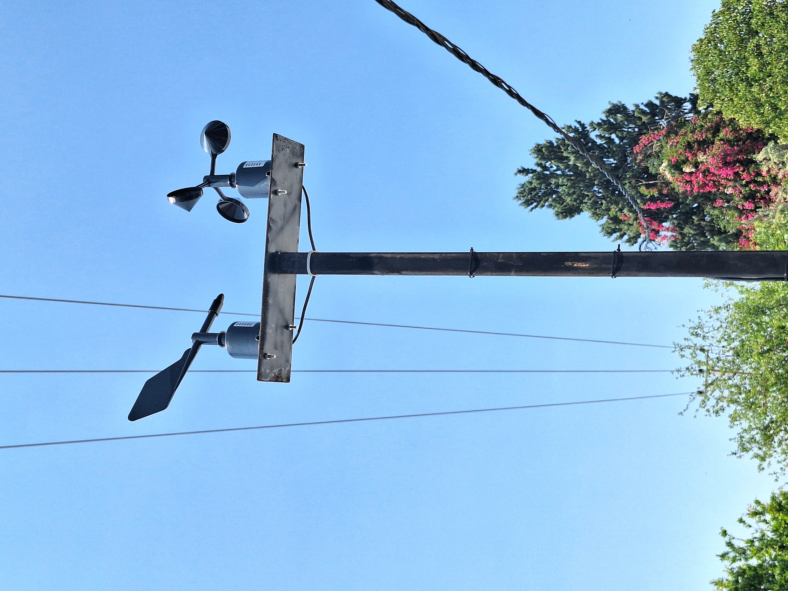

# ESP32-S2 Mini Weather Station

This repository contains the code and instructions to set up an ESP32-S2 mini weather station. The weather station is equipped with various sensors to measure wind speed, wind direction, pressure, humidity, and temperature. Additionally, it includes LEDs for status indication and necessary components for proper sensor interfacing.

## Features

- Measurement of wind speed using a wind speed sensor
- Wind direction detection with a wind direction sensor
- Pressure readings via BME280 sensor
- Humidity and temperature readings using the SHT31 sensor
- LED indicators for status (Green LED for normal operation, Red LED for alerts)
- MOSFET control for dimming the LEDs
- Voltage regulation with step-down converters (12V to 5.5V and 12V to 3.3V)
- Logic level conversion for sensor communication
- ADS1115 for precise wind data acquisition

## Components

- ESP32-S2: The main microcontroller unit that manages all sensor data and control.
- Wind Speed Sensor: Measures wind speed to provide real-time wind velocity data.
- Wind Direction Sensor: Detects wind direction to determine the prevailing wind's compass direction.
- BME280 Sensor: Provides pressure readings for weather forecasting.
- SHT31 Sensor: Measures humidity and temperature for accurate environmental monitoring.
- ADS1115: An ADC module used for precise analog-to-digital conversion of wind sensor data.
- Green LED: Indicates normal operation status.
- Red LED: Alerts about critical conditions or issues.
- IRLB8748 MOSFETs: Used for efficient switching and control of sensors.
- Step-Down Converters: Voltage regulators for stable power supply to the components.
- Logic Level Converter: Ensures proper voltage translation between components with different logic levels.

## Wiring

Follow the wiring diagram below to connect the components properly:

For detailed connections and pin assignments, refer to the `wiring_diagram.txt` file in this repository.

## BOM

| Name                                         | Quantity | Link                                                                                                                      | Picture |
|----------------------------------------------|----------|---------------------------------------------------------------------------------------------------------------------------|---------|
| 0.4 Axial, 0.25W Resistor 100               | 2        | [Link](https://www.aliexpress.com/item/1005006027365448.html?spm=a2g0o.order_list.order_list_main.658.3d44586ajupSXF) |         |
| 0.4 Axial, 0.25W Resistor 10K               | 2        | [Link](https://www.aliexpress.com/item/1005006027365448.html?spm=a2g0o.order_list.order_list_main.658.3d44586ajupSXF) |         |
| 0.4 Axial, 0.25W Resistor 4.7K              | 4        | [Link](https://www.aliexpress.com/item/1005006027365448.html?spm=a2g0o.order_list.order_list_main.658.3d44586ajupSXF) |         |
| 1.13 IPX U.FL IPEX to SMA                   | 1        | [Link](https://www.aliexpress.com/item/1005003637068635.html?spm=a2g0o.order_list.order_list_main.1553.3d44586ajupSXF) |         |
| 4CH LLC 5 to 3.3V                           | 1        | [Link](https://www.aliexpress.com/item/4000552920569.html?spm=a2g0o.order_list.order_list_main.1805.3d44586ajupSXF) |         |
| ADS1115 PCB Version                         | 1        | [Link](https://www.aliexpress.com/item/32817162654.html?spm=a2g0o.order_list.order_list_main.626.3d44586ajupSXF)    |         |
| Analoug Wind Direction Sensor (0-5V)        | 1        | [Link](https://www.aliexpress.com/item/1005004770322638.html?spm=a2g0o.order_list.order_list_main.1386.3d44586ajupSXF) |         |
| Analoug Wind Speed Sensor (0-5V)            | 1        | [Link](https://www.aliexpress.com/item/1005004770322638.html?spm=a2g0o.order_list.order_list_main.1386.3d44586ajupSXF) |         |
| BME280                                       | 1        | [Link](https://www.aliexpress.com/item/32862445164.html?spm=a2g0o.order_list.order_list_main.1366.3d44586ajupSXF)    |         |
| DD2712SA 3.3V                               | 1        | [Link](https://www.aliexpress.com/item/32949929824.html?spm=a2g0o.order_list.order_list_main.1698.3d44586ajupSXF)  |         |
| DD2712SA 5V                                 | 1        | [Link](https://www.aliexpress.com/item/32949929824.html?spm=a2g0o.order_list.order_list_main.1698.3d44586ajupSXF)  |         |
| DF Robot Gravity Board                      | 1        |                                                                                                                           |         |
| ESP32S                                       | 1        | [Link](https://www.aliexpress.com/item/1005005398604818.html?spm=a2g0o.order_list.order_list_main.1512.3d44586ajupSXF) |         |
| Green LED 12V                               | 1        | [Link](https://www.aliexpress.com/item/1005003482664110.html?spm=a2g0o.order_list.order_list_main.1316.3d44586ajupSXF) |         |
| IRLB8748PBF                                 | 2        | [Link](https://www.aliexpress.com/item/4000741527444.html?spm=a2g0o.order_list.order_list_main.1351.3d44586ajupSXF) |         |
| KF301-5.0-2P Terminal Block Connector       | 1        | [Link](https://www.aliexpress.com/item/1005003373535370.html?spm=a2g0o.order_list.order_list_main.1331.3d44586ajupSXF) |         |
| Latch Push Button                           | 1        |                                                                                                                           |         |
| Micro USB Male to Type C Female Cable       | 1        | [Link](https://www.aliexpress.com/item/1005005243863950.html?spm=a2g0o.order_list.order_list_main.488.3d44586ajupSXF) |         |
| Momentary Push Button                       | 1        |                                                                                                                           |         |
| PCB                                          | 1        |      [Link](docs/pcb_easyeda.json)                                                                                                                     |         |
| Rain Bucket(MS-WH-SP-RG)                    | 1        | [Link](https://www.aliexpress.com/item/2026877912.html?spm=a2g0o.order_list.order_list_main.451.3d44586ajupSXF)    |         |
| RJ11 Male to Male Cable                     | 1        |                                                                                                                           |         |
| RJ11 Panel Connector                        | 1        | [Link](https://www.aliexpress.com/item/1005002946551051.html?spm=a2g0o.order_list.order_list_main.578.3d44586ajupSXF) |         |
| Red LED 12V                                 | 1        | [Link](https://www.aliexpress.com/item/1005003482664110.html?spm=a2g0o.order_list.order_list_main.1316.3d44586ajupSXF) |         |
| SP13 Connector 2 Pins With Back Nut         | 1        | [Link](https://www.aliexpress.com/item/1005003180200877.html?spm=a2g0o.order_list.order_list_main.736.3d44586ajupSXF) |         |
| SP13 Connector 4 Pins With Back Nut         | 2        | [Link](https://www.aliexpress.com/item/1005003180200877.html?spm=a2g0o.order_list.order_list_main.736.3d44586ajupSXF) |         |
| SP13 Connector 5 Pins With Back Nut         | 2        | [Link](https://www.aliexpress.com/item/1005003180200877.html?spm=a2g0o.order_list.order_list_main.736.3d44586ajupSXF) |         |
| USB C Panel Connector                       | 1        | [Link](https://www.aliexpress.com/item/1005001290769478.html?spm=a2g0o.order_list.order_list_main.1356.3d44586ajupSXF) |         |
| Wifi Ant SMA Male                            | 1        | [Link](https://www.aliexpress.com/item/1005003496632185.html?spm=a2g0o.order_list.order_list_main.1516.3d44586ajupSXF) |         |
| XH 2.54 2 Pins Female                       | 12       | [Link](https://www.aliexpress.com/item/1005001530994945.html?spm=a2g0o.order_list.order_list_main.697.3d44586ajupSXF) |         |
| XH 2.54 2 Pins Male                         | 12       | [Link](https://www.aliexpress.com/item/1005001530994945.html?spm=a2g0o.order_list.order_list_main.697.3d44586ajupSXF) |         |
| XH 2.54 4 Pins Female                       | 8        | [Link](https://www.aliexpress.com/item/1005001530994945.html?spm=a2g0o.order_list.order_list_main.726.3d44586ajupSXF) |         |
| XH 2.54 4 Pins Male                         | 8        | [Link](https://www.aliexpress.com/item/1005001530994945.html?spm=a2g0o.order_list.order_list_main.726.3d44586ajupSXF) |         |

### ESP32 Wiring

| ESP32 Pin | Type      |
|-----------|-----------|
| 22        | SCL       |
| 21        | SDA       |
| 19        | Green LED |
| 18        | Red LED   |
| 17        | GPIO2     |
| 16        | GPIO1     |
| 15        | CFG SW    | 
| EN        | RST SW    |

## Connectors Wiring

### Connector Type: SP13 5 Pins

| Pin Num | Type     |
|---------|----------|
| 1       | 12V+     |
| 2       | GND      |
| 3       | Sig -(GND)|
| 4       | Sig +    |
| 5       | Spare    |

### Connector Type: SP13 4 Pins

| Pin Num | Type |
|---------|------|
| 1       | 3.3V+|
| 2       | GND  |
| 3       | SDA  |
| 4       | SCL  |

### Connector Type: SP13 2 Pins

| Pin Num | Type |
|---------|------|
| 1       | 12V+ |
| 2       | GND  |

This project is licensed under the [MIT License](LICENSE).
