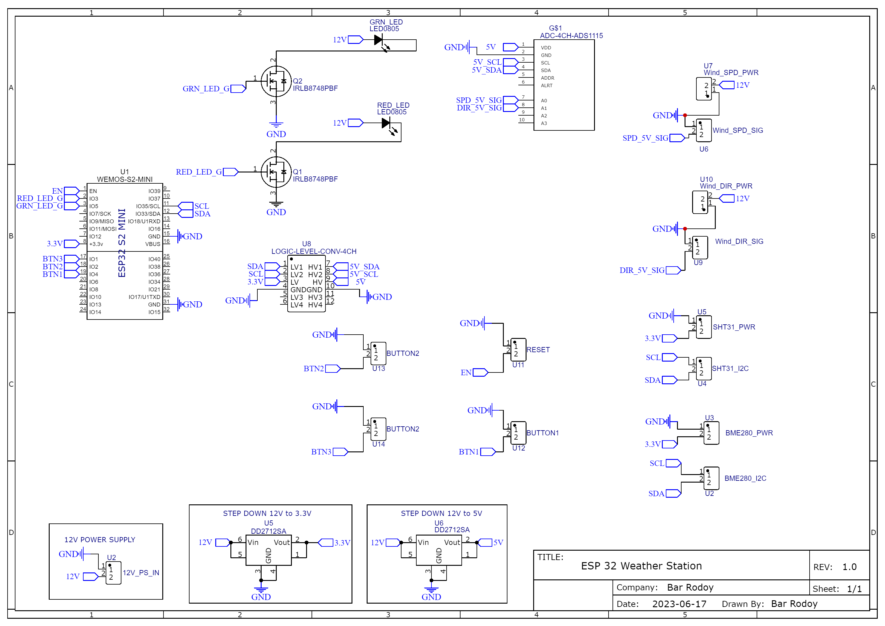

# ESP32-S2 Mini Weather Station

This repository contains the code and instructions to set up an ESP32-S2 mini weather station. The weather station is equipped with various sensors to measure wind speed, wind direction, pressure, humidity, and temperature. Additionally, it includes LEDs for status indication and necessary components for proper sensor interfacing.

## Features

- Measurement of wind speed using a wind speed sensor
- Wind direction detection with a wind direction sensor
- Pressure readings via BME280 sensor
- Humidity and temperature readings using the SHT31 sensor
- LED indicators for status (Green LED for normal operation, Red LED for alerts)
- MOSFET control for efficient sensor interfacing
- Voltage regulation with step-down converters (12V to 5.5V and 12V to 3.3V)
- Logic level conversion for sensor communication
- ADS1115 for precise wind data acquisition

## Components

- ESP32-S2: The main microcontroller unit that manages all sensor data and control.
- Wind Speed Sensor: Measures wind speed to provide real-time wind velocity data.
- Wind Direction Sensor: Detects wind direction to determine the prevailing wind's compass direction.
- BME280 Sensor: Provides pressure readings for weather forecasting.
- SHT31 Sensor: Measures humidity and temperature for accurate environmental monitoring.
- ADS1115: An ADC module used for precise analog-to-digital conversion of wind sensor data.
- Green LED: Indicates normal operation status.
- Red LED: Alerts about critical conditions or issues.
- IRLB8748 MOSFETs: Used for efficient switching and control of sensors.
- Step-Down Converters: Voltage regulators for stable power supply to the components.
- Logic Level Converter: Ensures proper voltage translation between components with different logic levels.

## Wiring

Follow the wiring diagram below to connect the components properly:

For detailed connections and pin assignments, refer to the `wiring_diagram.txt` file in this repository.

## Installation and Setup

1. Clone this repository to your local machine or download it as a ZIP file.
2. Open the project in your preferred ESP32 development environment (e.g., Arduino IDE, PlatformIO).
3. Make sure to install any required libraries listed in the code's dependencies section.
4. Connect your ESP32-S2 board to your computer via USB.
5. Upload the code to your ESP32-S2 board.
6. Monitor the serial output to observe sensor readings and system status.

## Usage

- The ESP32-S2 will collect data from all the sensors and provide real-time information through the serial monitor.
- Green LED indicates normal operation. Red LED indicates alerts or critical conditions.
- Modify the code to implement specific actions based on sensor readings, such as sending alerts or storing data.

## Contributing

Contributions to this project are welcome! If you find any issues or want to enhance the functionality, feel free to create a pull request.

## License

This project is licensed under the [MIT License](LICENSE).
